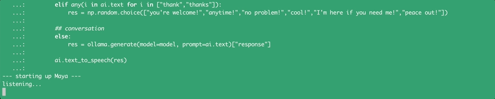
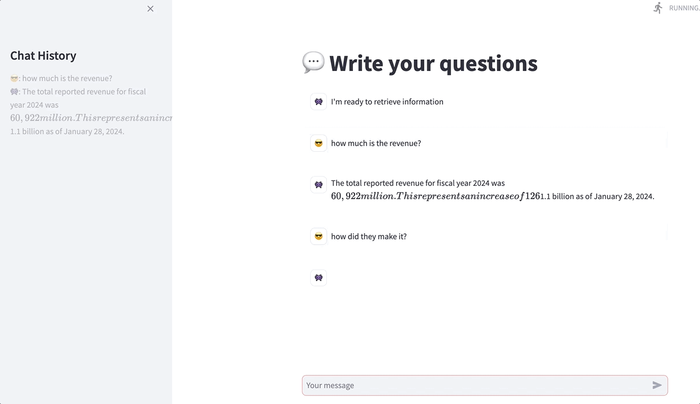

# Generative Artificial Intelligence with Python

In this repo you can find useful examples of GenAI & LLM applications.\
All the projects are documented on [*Medium*](https://maurodp.medium.com/).

 

- <ins>**[LLM Chatbot](https://github.com/mdipietro09/GenerativeAI/tree/main/Chatbot)**</ins>
 	
	

 

- <ins>**[RAG](https://github.com/mdipietro09/GenerativeAI/tree/main/RAG)**</ins>
 
	

 
