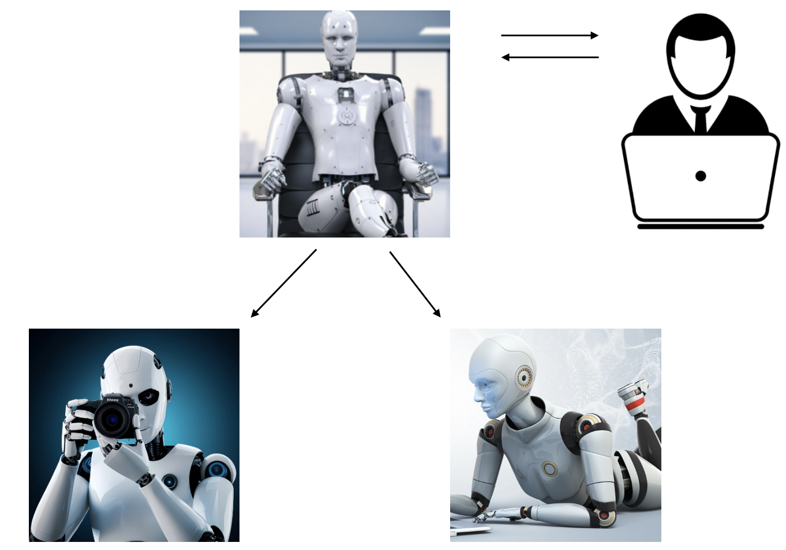
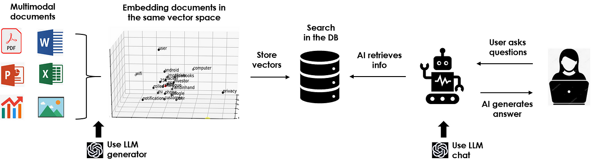

# Generative Artificial Intelligence with Python

In this repo you can find useful examples of GenAI & LLM applications.\
All the projects are documented on [*Medium*](https://maurodp.medium.com/).

 

<ins>**[LLM Chatbot](https://github.com/mdipietro09/GenerativeAI/tree/main/Chatbot)**</ins>
 
	Build a voice assistant LLM ChatBot on your laptop with Ollama and Speech Recognition.
 
	

 

<ins>**[Agents](https://github.com/mdipietro09/GenerativeAI/tree/main/Agents)**</ins>
 
	Create an AI squad to automate literally anything on your laptop without GPU.
 
	

 

<ins>**[RAG](https://github.com/mdipietro09/GenerativeAI/tree/main/RAG)**</ins>
 
	Build your own ChatGPT with multimodal data and run it on your laptop without GPU.
 
	

 
